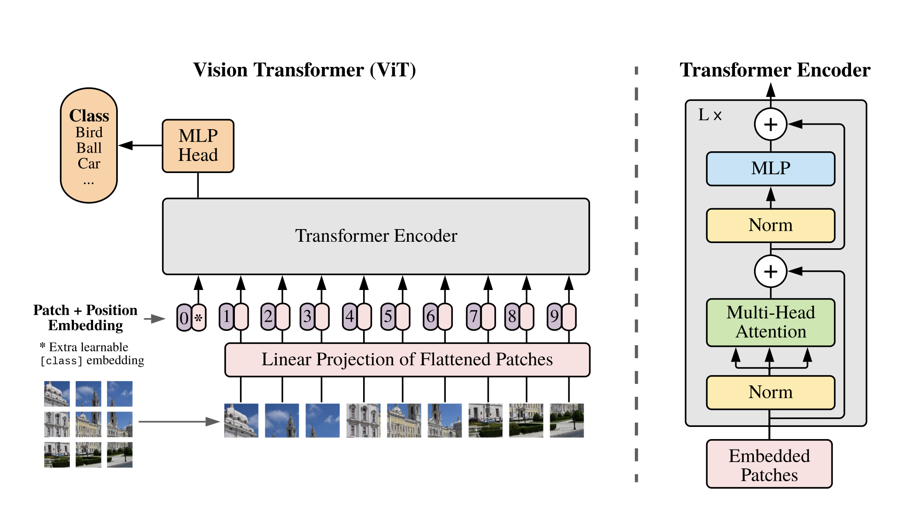
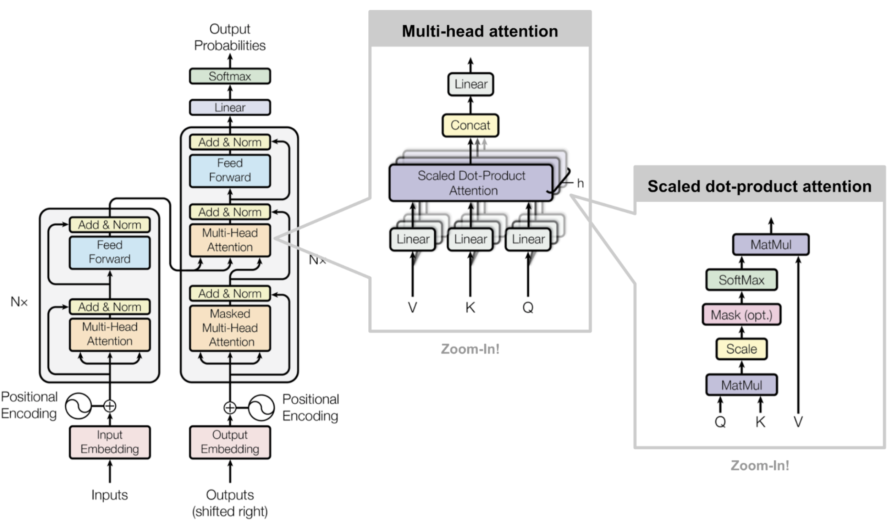

## 摘要

## 绪论（1～5）

### 研究背景及研究意义

### 研究现状

### 工作内容/目标

### 论文结构

## 相关原理和技术（6～12）

这一部分主要介绍一些处理分类任务的方法，分别从图像分类，文本分类以及多模态分类三个任务来详细阐述，具体到每个任务都有多种常见的方法，下面一一说明。

- 图像分类任务
  
  给定一张图片$P$，试图找到一个模型$f$，在某种损失函数$L$下，其误差$L(f(P),y)$最小，其中$y$是图片$P$的标签。常用的方法主要是卷机神经网络。但在最近一段时间，以ViT为代表的一系列视觉Transformer被研究者提出，并且在视觉分类任务上取得了不俗的效果，下面进行详细介绍
  
  - 卷积神经网络
  
    和传统的全连接神经网络一样，卷积神经网络由输入层，隐藏层，输出层。其中隐藏层通常包含多个卷积层，每个卷积层涉及一系列卷积，池化，全连接，归一化操作。具体来说，卷积指的是卷积核与输入特征的点积操作，且通常为Frobenius内积，激活函数通常为RELU或者Sigmoid。当卷积核沿着该层的输入矩阵滑动时，卷积运算将生成一个特征图，该特征图便是下一层的输入。 接下来是其他层，例如池化层，全连接层和归一化层。下图是两种卷积神经网络的结构，LeNet早在20世纪90年代就已被提出，用于解决数字识别问题。而AlexNet的出现，大幅提升了Imagenet图像识别的准确率，也是近年来深度学习热潮的先驱。现如今，残差神经网络Resnet已是卷积神经网络的代表。
  
    
  
  - 视觉transformer
  
    鉴于Transformer在自然语言处理领域中的统治地位，近几个月，研究人员探索Transformer架构在图像中的应用。ViT(Vision Transformer)，完全抛弃卷积操作，而遵循Transformer架构，在图像识别领域取得了不俗的效果。其模型结构如下。
  
    
  
    对于一张图片$P$，首先将其切割为若干个图片块（Patch），每个图片块的大小固定，且切割顺序固定。将每个Patch输入给一个线性层，将它们映射成一维张量。在该张量前面添上一个特殊占位符【class】，用于分类。再加上位置编码后输入给一个Transformer编码器。将【class】占位符的隐变量通过一个线性层用于分类。
  
    ViT使用的Transformer编码器与传统的Transformer类似，输入张量首先经过Layer Normalization，在输入给Multi-Head Attention层做自注意力点积，还配备有残差连接。最后再通过一个Layer Normalization层和一个全连接层。
  
    随着ViT的出现，越来越多的研究人员开始探索视觉Transformer，也因此出现了很多变种，包括Swin Transformer（SwinT），Transformer in Transfomer（TNT），Pooling-based Vision Transformer（PiT），本文也重点研究这几种具有代表性的视觉Transformer。
  
  - 预训练视觉模型
  
    上面一部分介绍了视觉Transformer的结构，这里介绍其预训练过程以及实验结果。
  
    Vision Transformer的预训练过程与传统预训练有差别。传统的预训练是无监督学习，拿BERT举例，只需要大量的无标注文本，即可进行预训练（会在下文详述）。而Vision Transformer进行的是有监督预训练。具体来说就是预测图像所属类别，并与真实值进行比较，计算损失函数，梯度回传，更新参数。迁移到下游任务上也仅仅是更换数据集。因此这也是视觉Transformer的令人诟病之处。
  
    但这不影响其优越的实验结果，拿Swin Transformer举例，无论是在图像分类任务上，还是在目标检测任务上，都取得了优于卷积神经网络的效果。下表列举了一些主要的结果，可以看到，Swin Transformer的效果超过了所有卷积神经网络。
  
- 文本分类任务

  给定一句文本$T$，试图找到一个模型$f$，在某种损失函数$L$下，其误差$L(f(T),y)$最小，其中$y$是文本$T$的标签。最初用于解决文本分类任务的是循环神经网络，代表模型有LSTM，GRU。其主要思想就是将文本逐词输入给模型，一个时间点上模型只处理一个单词，即串行处理输入。但自从Transformer提出后，循环神经网络几乎已被遗忘。Transformer的主要思想是自注意力机制（Self-Attention）。一个很大的优点就是可以并行处理文本输入，即整个句子同时输入给模型。大大减少了时间开销。Transformer的效果也远远超出了LSTM/GRU。下面对其模型结构以及预训练目标进行详细阐述。
  
  - self-attention
  
    
  
    Self-attention的主要组成部分是Multi-head Attention，其又是有多个Scaled dot-product Attention构成。该点积操作可用如下公式表示
    $$
    Attention(Q,K,V) = softmax(\frac{QK^T}{\sqrt{n}})V
    $$
    
  
    其中$Q,K,V$分别代表Query，Key，Value。三者都是由同一个输入张量，经过线性变换得倒，这也是称其为“自”注意力机制的原因。$n$代表张量的维度。由于张量维度较高，因此在进行点积操作时，得到的结果数值可能会很大，因此要除以$\sqrt{n}$进行缩小。所谓Multi-Head就是指有多个自注意力头，再将每个头的输入进行拼接以得到最后的输出结果。具体公式如下
    $$
    MultiHead(Q,K,V) = [head_1,head_2,...,head_h]W^O\\
    where\ head_i = Attention(QW_i^Q,KW_i^K,VW_i^V)
    $$
    
  
  - 预训练语言模型
  
    上述内容介绍了Self-attention的结构，但使Transformer真正强大起来的是预训练技术。最近火热的BERT以及各种变种，包括Roberta，Deberta，T5，中心思想都是通过预训练来提升模型的表示能力。因此BERT的真正作用就是用于编码文本数据，为下游分类器提供文本特征。下面会具体介绍预训练目标
  
- 多模态分类任务

  - 多模态transformer
  - late/early fusion

## 设计与实现（13～25）

本章首先介绍本文解决多模态情感分析的方法，包括符号定义，数据预处理，模型结构，训练细节等。在此之上，对实验结果进行分析。同时做了控制实验用于对模型中不同框架对作用进行分析。

在介绍具体的方法之前，先对一些下文常用到的符号进行定义

|         $X_t$          |             文本输入             |
| :--------------------: | :------------------------------: |
|         $X_i$          |             图像输入             |
| $Y_t(\overline {Y_t})$ | 文本对应的标签（文本模型的预测） |
| $Y_i(\overline {Y_i})$ | 图像对应的标签（图像模型的预测） |
|   $Y(\overline {Y})$   |   综合文本，图像的标签（同上）   |
|         $M_t$          |        用于编码文本的模型        |
|         $M_i$          |        用于编码图像的模型        |
|          $M$           |            多模态模型            |
|         $H_t$          |        文本模态的特征向量        |
|         $H_i$          |        图像模态的特征向量        |
|          $H$           | 融合后的特征向量（全局特征向量） |
|         $L_t$          |         文本模态的Logits         |
|         $L_i$          |         图像模态的Logits         |
|          $L$           |           多模态Logits           |

### 数据预处理

- 文本预处理

  本文选取的数据集中的文本大多数为英语，因此首先将其全部转为小写，在去除收尾的空白符号（换行，制表符），再直接使用空格进行分词。分词之后，并在首部加上【CLS】占位符（用于分类），尾部加上【SEP】占位符，利用BertTokenizer进行转化为词表中的索引。具体来说，在BERT进行预训练的时候，会维护一个词表，记录所有输入的单词。在解决下游任务的时候，直接使用该词表来进行词到索引的转换，对于预训练中没有出现过的单词，将其转换为一个特殊的【UNK】占位符。将转换后的文本输入记为$X_t$
  $$
  X_t \leftarrow BertTokenizer([CLS],X_t,[SEP])
  $$

- 图像预处理

  为了适配模型，首先将图像的大小调整为256\*256，再截取图像中间的224\*224个像素点作为最终的图像，并将每个像素值除以255，转换到【0，1】这个区间当中。由于模型大多数都在Imagenet上预训练，因此需要将输入的图片按照Imagenet数据集的均值和标准差进行归一化。具体来说。图像为RGB三通道，故对每一个通道都进行归一化。记为$X_i$。具体来说每个通道的均值分别为0.485, 0.456, 0.406，标准差分别为0.229, 0.224, 0.225。
  $$
  X_i \leftarrow \frac{X_i - mean}{std}
  $$

### 基于视觉transformer的图像情感分类

​	对于图像情感分类，这里采用以Vision Transformer（ViT）为代表的一系列视觉transformer。视觉transformer最初提出是用于图像分类，目标检测这类视觉任务中，即识别出一张图像中的物体，本文将其称为图像的浅层信息。但情感识别任务需要判断出图像中的物体所蕴含的情感，本文将其称为图像的深层信息。

​	具体来说，给定图像输入$X_i$
$$
H_i = ViT(X_i) \\
\overline{L_i} = W^T(H_i) \\
\overline{Y_i} = \arg \max(Softmax(\overline{L_i})
$$
​	其中，$H_i$为编码后的图像特征，通常为一个高维向量（ViT中为1024维）。 $W$为可学习的矩阵，用于将ViT编码后的隐变量变换为输出维度的向量，输出维度即为情感种类个数，通常为二或者三。$Softmax(y)_j = \frac{e^{y_j}}{\sum_{k}e^{y_k}}$

​	训练过程中用交叉熵作为损失函数
$$
Loss = CrossEntrophy(\overline{L_i}, Y_i)
$$

​	交叉墒函数表达式如下
$$
CrossEntrophy(t,y) = -\sum_{k}t_k\log y_k
$$
 	其中$t$为真实值，$y$为预测值。

### 基于BERT的文本情感分类

​	由于预训练模型的强大编码能力，BERT已经取代了以LSTM/GRU为代表的循环神经网络。故对于文本情感识别直接采用BERT进行分类。BERT是由若干个transformer encoder堆叠而成，并且在Wikipedia上进行无监督预训练得到的模型。有关BERT的更详细内容可见相关原理部分。Huggingface提供了一套规范的接口，以及预训练好的参数。这里直接采用其提供的模型。这里选择BERT的版本是“bert-base-uncased”。

​	具体来说，给定文本输入$X_t$
$$
\overline{L_t} = W^T(BERT(X_t)) \\
\overline{Y_t} = \arg \max(Softmax(\overline{L_t})
$$
​	其中，$W$为可学习矩阵，用于将BERT编码后的隐变量变换为输出维度的向量，输出维度即为情感种类个数，通常为二或者三。

​	训练过程中同样使用交叉熵作为损失函数
$$
Loss = CrossEntrophy(\overline{L_t}, Y_t)
$$

### 多模态情感分类

​	对于多模态情感分类任务，主要有两个研究内容，1）如何编码各个模态的输入。2）如何融合不同模态的特征。这部分主要解决第一个问题，而把第二个问题放在Ablation Study中进行探索

​	编码部分主要分为两种处理方式。1）利用不同的模型对不同模态的输入进行编码，即图像编码器编码图像，文本编码器编码文本。再将编码后的模态特征向量进行特征融合，最后将全局特征输入给一个分类器进行情感分类。2）将不同模态的输入拼接成一个全局输入，输入给一个模型进行编码，即多模态编码器，最后直接将特征向量输入个一个分类器。下面具体介绍这两种方法。

- 不同模态输入单独编码

  

  该模型的具体结构见图，左半部分代表图像编码器，这里的Image_Encoder可以卷机神经网络，也可以是视觉Transformer；而Text_Encoder是BERT。对于具体的编码方式在前面两个部分已经具体介绍过了，这里只从特征融合这一步开始具体介绍。

  首先将图像特征$H_i$,文本特征$H_t$拼接为全局特征$H$，即
  $$
  H = concatenate(H_i,H_t)
  $$
  再将$H$输入给一个线性分类层得到logits，再通过一个softmax层得到概率分布
  $$
  \overline{L} = W^TH \\
  \overline{Y} = \arg \max {Softmax(\overline{L})}
  $$
  与单模态情感分类类似，训练过程中使用交叉墒作为损失函数

- 不同模态输入统一编码，Multimodal BERT(MMBT)

  

  该模型的具体结构见图，编码流程可以分为两部分

  1）首先利用一个图片编码器提取出图像的特征。具体来说，拿Resnet152举例。将倒数第二层的特征图（feature map）进行池化后，变换成若干个1*1的特征图。同样的，这里也可以使用视觉Transformer作为图像编码器，即直接将【CLS】位置上的隐变量作为图像特征
  $$
  X_i \leftarrow Image\_Encoder(X_i) \\
  X = Concatenate(X_t,X_i)
  $$
  

  2）将这些特征拼接到文本模态输入的后面，作为全局输入。将其输入到BERT当中，利用【CLS】对应的隐变量进行分类。数学公式如下
  $$
  H = BERT(X)\\
  \overline{L} = W^TH\\
  \overline{Y} = \arg \max Softmax(\overline{L})
  $$
  同样的，训练过程中的损失函数为交叉墒

  

### 实现细节

本文所有代码均使用python实现，涉及到模型流水线的代码使用Pytorch框架，涉及到模型具体结构的代码使用Huggingface和Timm开源仓库。其中Huggingface仓库包含了大量的预训练语言模型，包括BERT，Roberta，Deberta等，Timm包含了大量的预训练视觉模型，包括Resnet，ViT，SwinT等。

这里选择使用Huggingface提供的AdamW作为优化器，所有实验都在亚马逊云服务提供的Tesla T4 GPU上运行。具体的开源代码可见https://github.com/zhangjiahui-buaa/Thesis。

更具体的超参数列在附录中。

### 实验结果

#### 评价指标

这里具体介绍本文实验中的两种评价指标

- Accuracy（准确率）：分类正确个数/总数
- AUROC（操作特征曲线下的面积）：AUROC为ROC曲线下的面积。 ROC曲线显示了不同决策阈值的真阳性率（TPR）和假阳性率（FPR）之间的权衡。其中真阳性率为TP/(TP+FN)，假阳性率为FP/(FP+TN)，TP代表True positive（真值为1且预测为1），TN代表True negative（真值为0且预测为0），FP代表False positive（真值为0但预测为1），FN代表False negative（真值为1但预测为0）。

#### 实验数据集

这里具体介绍本文实验中将会用到的两个多模态情感识别数据集

- MVSA Single Dataset

  MVSA源自社交媒体Twitter上用户发表的言论，囊括了日常生活中的各个方面。该数据集包含5000个样本。由于没有标准的训练集-验证集划分，本文直接随机选取500个样本作为验证集。每个样本包括一张图片，一句文本以及对应的图片情感标签和文本情感标签。但没有提供多模态情感标签（综合考虑图片和文本后得到的情感标签）。因此该数据集主要用于单模态情感分析，具体来说：验证视觉transformer解决图像情感分析的能力以及验证BERT解决文本情感分析的能力。

  

- Hateful Meme Dataset

  Hateful Meme数据集是由Facebook提供一个用于检测仇恨言论的数据集，包含10000个训练样本，500个验证样本，以及2000个测试样本。同样的，每个样本包括一张图片，一个文本。与MVSA不同的是，Hateful Meme数据集只提供多模态情感，即综合考虑图像和文本后标注的情感标签。由于涉及到仇恨检测，通常需要综合考虑文本和图像才能得到正确的情感。因此在本文中，该数据集主要用于多模态情感分析。

贴图

有关数据集更详细信息列在了附录中

#### 实验模型

这里简单介绍一下实验中用到的三种模型，更具体的模型结构可以参照前文的相关工作一部分

- 卷积神经网络Resnet152：该模型是典型的卷积神经网络，在计算机视觉领域中已经有广泛的应用，这里将其作为主要的基线模型用以比较。
- 视觉Transformer（Vit，Swint，TNT，PiT）：这些模型都是最近一段时间出现的视觉Transformer模型，并且在图像识别，目标检测一系列视觉任务中达到了与CNN媲美的效果，Swint在一些任务上的效果甚至超过了当前的SOTA模型。
- 多模态Transformer（MMBT）：该模型是基于Transformer架构的用于解决多模态任务的模型。

#### 图像情感分类

本文第一个研究点是探索Transformer对于图像的编码能力，这里选用MVSA数据集中的图片进行实验。表格中带有Vanilla前缀的模型代表该模型没有在Imagenet上预训练过。从结果上可以看出，Swint的准确率和AUROC都是最高的。同时，所有视觉Transformer的AUROC都要高于Resnet152的AUROC，这验证了视觉Transformer提取图像深层信息的能力是不逊于卷机神经网络。

|          | Resnet152 | Vit   | Swint     | TNT   | PiT   |
| -------- | --------- | ----- | --------- | ----- | ----- |
| Accuracy | 67.50     | 66.75 | **67.75** | 66.75 | 66.00 |
| AUROC    | 78.89     | 81.19 | **81.79** | 78.94 | 80.42 |

#### 文本情感分类

文本情感分类结果如下，这里选用MVSA数据集中的文本进行实验。由于MVSA数据集是源自推特用户的言论，当中包含大量不规范的语言，特别是OOV（out of vocabulary）单词，例如网址url，单词缩写。由于在预训练中没有出现过，这些词在通过BertTokenizer时会转化为同一个特殊占位符【UNK】。大量的【UNK】会影响BERT的表示能力，这也解释了为何文本情感分类准确率如此之低。

|          | BERT  |
| -------- | ----- |
| Accuracy | 54.50 |
| AUROC    | 65.41 |

#### 多模态情感分类

下表对应着第一种编码方式，即不同模态采用不同编码器。由于文本编码器均为BERT，故下表只列出了图像编码器。从准确率上来看，每个模型的效果都差不多，Vit以微弱的优势取得第一名，略高于Resnet152和其余视觉Transformer。但从AUROC上来看，所有的视觉Transformer都要高出Resnet152四到五个点。验证了视觉Transformer强大的图像的编码能力能够提升多模态情感识别的准确率。

| Image Encoder | Resnet152 | Vit       | Swint | TNT   | PiT   |
| ------------- | --------- | --------- | ----- | ----- | ----- |
| Accuracy      | 60.40     | **61.60** | 60.00 | 59.40 | 60.60 |
| AUROC         | 62.90     | **66.80** | 66.20 | 65.37 | 65.66 |

下表对应着第二种编码方式，即多模态Transformer统一编码多模态输入。同样的，每一列代表着不同的图像特征提取器。结果在意料之中，无论从准确率还是从AUROC的结果来看，视觉Transformer都要优于卷积神经网络

| MMBT Image Encoder | Resnet152 | Vit       | Swint | TNT       | PiT   |
| ------------------ | --------- | --------- | ----- | --------- | ----- |
| Accuracy           | 60.60     | 62.40     | 61.40 | **63.80** | 62.60 |
| AUROC              | 65.57     | **68.79** | 67.40 | 66.78     | 66.92 |

### Ablation studies

这一部分对于模型中相关模块的作用进行探索，主要试图回答如下几个问题

- 是否需要预训练

  对于Transformer模型来说，预训练基本上是一个默认的设定，近年来大火的BERT，Roberta，T5等等都是在各种庞大的语料库上先预训练，再用于下游任务当中。Vision transformer也一样，上述的ViT，Swint，TnT，PiT都是在ImageNet数据集上预训练后迁移到下游的视觉任务当中。一个自然的问题是，一个未预训练过的Vision Transformer（即参数随机初始化）的效果如何（这里特指和未预训练过的卷积神经网络进行比较）

  |          | Resnet152 | Vanilla Resnet152 | Vanilla ViT | Vanilla Swint | Vanilla TNT | Vanilla PiT |
  | :------: | :-------: | :---------------: | :---------: | :-----------: | :---------: | :---------: |
  | Accuracy |   67.50   |       56.00       |    58.75    |   **59.25**   |    58.75    |    58.50    |
  |  AUROC   |   78.89   |     **66.21**     |    65.45    |     61.02     |    64.61    |    62.85    |

  |          |  ViT  | Vanilla ViT | Vanilla Swint | Vanilla TNT | Vanilla PiT |
  | :------: | :---: | :---------: | :-----------: | :---------: | :---------: |
  | Accuracy | 61.60 |    57.4     |     56.60     |    55.40    |  **58.00**  |
  |  AUROC   | 66.80 |    62.78    |     62.86     |    62.82    |  **63.28**  |

  第一张表格是在MVSA数据集上进行图像情感分类得到的结果，可以看出，Resnet152的AUROC值位列第一，说明预训练对于Transformer的提升要大于对于卷积神经网络的提升。这一点是符合直觉的。因为卷积操作天生就有提取图像特征的能力。而和经过预训练的Resnet152比较，剩余模型都有很大的差距，说明预训练对于图像模型也是有很大作用的。

  第二章表格是在Hateful-Meme数据集上进行多模态情感分类得到的结果，编码方式为分开编码。可以看出，去除预训练，Vision Transformer的能力会有明显的下降，这证明了预训练的重要性。

  因此得出结论，大规模预训练对于自注意力机制是必不可少的。

- 特征融合方式

  特征融合是多模态学习领域中的一个重点，在之前的模型中，只用了early-fusion这一种融合，方式。为了探索不同特征融合方式对于分类准确率的影响，这里又对三种特征融合方式进行实验。具体来说有：1）late-fusion，该方法首先将不同模态的特征通过不同的分类器进行分类，再将两个分类结果进行分析得到最终呢的分类结果。2）LTC（Linear-Then-Concatenate），该方法首先将不同模态的特征先通过不同的线性层，变换特征维度，然后再进行拼接。3）STC（Self Attention-Then-Concatenate），该方法首先在不同模态特征上做self-attention，得到新的模态特征，然后再进行拼接并分类。

  <table>
      <tr><td></td><td>Resnet152</td><td></td><td></td><td>ViT</td><td></td><td></td></tr>
      <tr><td></td><td>late-fusion</td><td>LTC</td><td>STC</td><td>late-fusion</td><td>LTC</td><td>STC</td></tr>
      <tr><td>Accuracy</td><td>60</td><td>58.4</td><td>55.4</td><td>61.8</td><td>59.8</td><td>57.2</td></tr>
      <tr><td>Auroc</td><td>61.1</td><td>60.2</td><td>56.1</td><td>67.2</td><td>63.5</td><td>60.9</td></tr>
  </table>

  从结果上来看，late-fusion和early-fusion的准确率几乎没有差别，出乎意料的是，LTC和STC的准确率却有所下降。这是反直觉的，因为LTC和STC会增加模型的参数量，参数越多，模型的表示能力理应越强，而这里却有所下降。这里推测的原因是：经过线性层（或者自注意力层）的模态特征被污染了，不如编码器直接输出的隐变量。因此直接用编码器输出的隐变量做分类的效果要比多加一层线性层（自注意力层）的效果好。

- ensemble models

  模型集成是一种常见的用于提升准确率的方式。常规的方法是在训练中同时训练多个模型。但由于计算资源的限制，同时训练多个模型的显存需求远远超过了一张显卡的显存。故这里采用一种简化的模型集成方式，具体来说：依次训练好多个模型，并保存预测结果，按少数服从多数的原则决定集成后的预测结果。这里尝试了不同组合方式下的模型集成效果

  |          | Resnet+Vit+Swint | Vit+Swint+TNT | Resnet+Vit+Swint+Tnt+Pit | ViT   |
  | -------- | ---------------- | ------------- | ------------------------ | ----- |
  | Accuracy | 62.40            | 59.20         | 60.20                    | 61.60 |
  | AUROC    | **67.11**        | 65.49         | 66.25                    | 66.80 |

  该表是在Hateful-Meme数据集上进行多模态情感分类得到的结果。Resnet+ViT+Swint代表用这三种模型预测的结果投票，遵循少数服从多数的原则，另外两个类似。可以看出Resnet+ViT+Swint比单独使用ViT的效果要高，但是Vit+Swint+TNT和Resnet+Vit+Swint+Tnt+Pit却要比ViT更低。一方面说明模型集成这种方法会带来准确率的提升，另一方面说明不恰当的集成方式也有可能会造成准确率的下降。

- Faster R-CNN feature exractor

  在MMBT模型中，本文采用的图像编码器均为卷积神经网络或者视觉Transformer。另外一种常用的特征提取器是Faster R-CNN。该模型主要用于目标检测当中（具体介绍一下），其提取出的特征这里称为Region-Feature，而前文提取的特征统一称为Grid-Feature。

  |          | MMBT-Region |      | MMBT-Grid(Resnet) | MMBT-Grid(ViT) |
  | -------- | ----------- | ---- | ----------------- | -------------- |
  | Accuracy | 64.80       |      | 60.60             | 62.40          |
  | AUROC    | 72.62       |      | 65,57             | 68.79          |

  从结果上来看，MMBT-Region相比于MMBT-Grid有显著的提升，说明Faster R-CNN对于图像特征提取的能力更适用于MMBT这种结构。但是ViT的表现依旧要优于Resnet。后续工作可以考虑如何将Faster R-CNN和视觉Transformer相结合。

### 错误分析（随机选100个分析）(500字)

这一部分主要对错误样本进行分析。这里选取ViT+BERT的编码方式，Hateful Meme数据集。验证集上的错误样本一共有192个，这里随机选取100个，从如下几个方面进行分析

- 真实标签
- 样本所属类别
- 平均预测概率
- 是否涉及种族歧视

## 模型部署展示（26～30）

模型部署主要采用Streamlit框架。Streamlit是一个开放源代码的Python库，可轻松创建和共享用于机器学习和数据科学的漂亮的自定义Web应用程序。这里的模型采用的是不同模态的输入分开编码，且图像编码器为ViT。

首先将其在Hateful Meme数据集上训练并保存模型参数。利用Streamlit定义的API，可以方便的上传图像和输入文本。服务器端接收输入后，会自动输入给模型并给出预测结果返回给用户。下图是在本机8501端口的示例Web app

## 

## 附录

- 超参数
- 数据集细节

